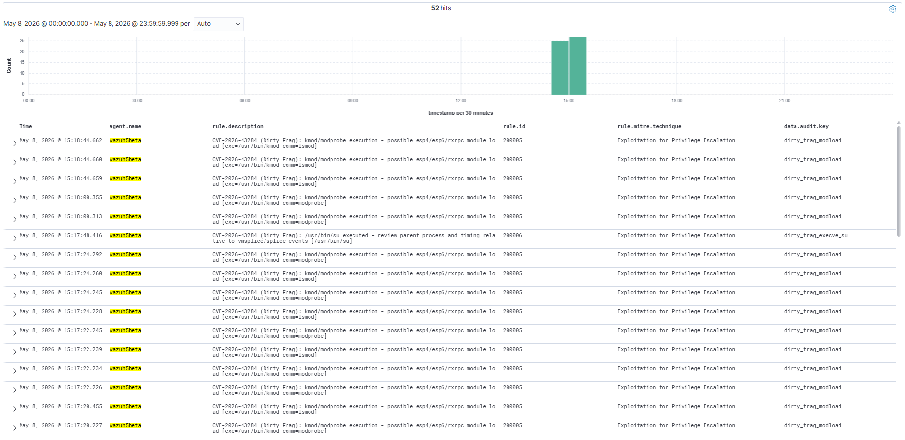
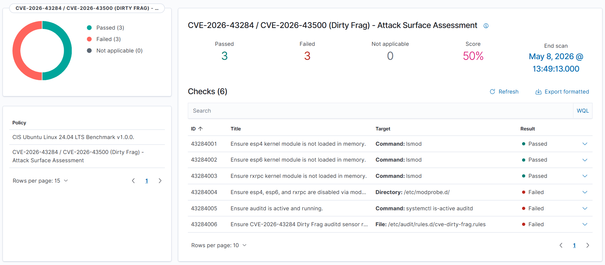
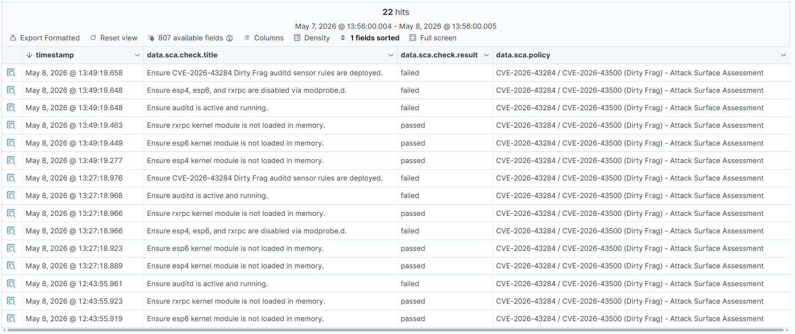

# DIRTY FRAG Detection with Wazuh 4.14.4 - CVE-2026-43284 / CVE-2026-43500

> **Detection engineering for the Dirty Frag kernel LPE - Ubuntu / RHEL / Debian / Amazon Linux**

[](https://github.com/mym0us3r/DIRTY-FRAG-Detection-with-Wazuh-4.14.4)
[](https://github.com/mym0us3r/DIRTY-FRAG-Detection-with-Wazuh-4.14.4)
[](https://github.com/mym0us3r/DIRTY-FRAG-Detection-with-Wazuh-4.14.4)
[](https://attack.mitre.org/techniques/T1068/)
[](https://github.com/V4bel/dirtyfrag)
[](https://github.com/V4bel/dirtyfrag)

---

## What is Dirty Frag?

CVE-2026-43284 / CVE-2026-43500 is a Linux kernel Local Privilege Escalation (LPE) that chains two independent page-cache write primitives to achieve root from an unprivileged user account. A single compiled binary achieves root on all major Linux distributions. No race condition. No heap spray. No kernel offset required.

**Variant 1 - CVE-2026-43284 (xfrm-ESP):**

```
unshare(CLONE_NEWUSER|CLONE_NEWNET)
-> register XFRM SA via netlink (CAP_NET_ADMIN inside new namespace)
-> vmsplice(ESP header into pipe)
-> splice(target file into pipe)
-> splice(pipe to UDP socket)
-> esp_input() in-place AEAD decrypt writes 4 bytes into page cache
```

**Variant 2 - CVE-2026-43500 (RxRPC):**

```
add_key("rxrpc", ...)       no privileges required
-> socket(AF_RXRPC=35)
-> RxRPC handshake + forged DATA packet
-> vmsplice(RxRPC wire header into pipe)
-> splice(target file into pipe)
-> splice(pipe to UDP socket)
-> rxkad_verify_packet_1() in-place pcbc(fcrypt) decrypt writes 8 bytes into page cache
```

When `CLONE_NEWUSER` is blocked by AppArmor (Ubuntu 24.04+ default), the exploit automatically falls back from the ESP variant to the RxRPC variant. The same binary achieves root on both cases.

> **CRITICAL:** The Copy Fail mitigation (blacklisting `algif_aead`) does **not** protect against Dirty Frag. Both vulnerabilities share the same authencesn sink, but Dirty Frag is triggered through a completely different code path. If you deployed the [Copy Fail](https://github.com/mym0us3r/COPY-FAIL-Detection-with-Wazuh-4.14.4) mitigation, you are still exposed.

> Discovered and published by **V4bel** - https://github.com/V4bel/dirtyfrag

---

## Official References

| Resource | Link |
| --- | --- |
| PoC - dirtyfrag (exp.c) | https://github.com/V4bel/dirtyfrag |
| CVE-2026-43284 | https://github.com/V4bel/dirtyfrag |
| CVE-2026-43500 | https://github.com/V4bel/dirtyfrag |
| Kernel Fix - commit f4c50a4034e6 | https://github.com/torvalds/linux/commit/f4c50a4034e6 |
| Mitigation Reference - CloudLinux | https://blog.cloudlinux.com/dirty-frag-mitigation-and-kernel-update |
| Related - Copy Fail (CVE-2026-31431) | https://github.com/mym0us3r/COPY-FAIL-Detection-with-Wazuh-4.14.4 |
| MITRE ATT&CK T1068 | https://attack.mitre.org/techniques/T1068/ |

---

## Why FIM Fails - Why This Repo Exists

Dirty Frag writes directly into the in-memory page cache. The on-disk binary is never modified. The kernel never marks the corrupted page as dirty, so writeback never runs. The disk file is byte-for-byte identical to the original before and after exploitation.

```
Traditional FIM approach:
  read file from disk -> compute hash -> compare -> no anomaly reported

Dirty Frag reality:
  on-disk /usr/bin/su = UNCHANGED
  page cache of /usr/bin/su = CONTAINS ROOT SHELL ELF
  FIM result = BLIND
```

The only effective detection is behavioral, via syscall monitoring at the kernel level. This repository provides production-validated Wazuh rules that detect both exploit variants at the syscall level, regardless of kernel version or patch status.

---

## Exploit Chain

```
ESP variant (CVE-2026-43284):
  unshare(CLONE_NEWUSER)    privilege boundary bypass via user namespace
  -> XFRM SA registration  CAP_NET_ADMIN gained inside new netns
  -> vmsplice()        [!]  ESP header planted into pipe
  -> splice()          [!]  /usr/bin/su page cache enters pipe
  -> splice()               pipe delivered to UDP socket
  -> esp_input() decrypt    4 bytes written deterministically into page cache
  -> execve(/usr/bin/su)    corrupted setuid binary runs shellcode as UID 0

RxRPC variant (CVE-2026-43500):
  add_key("rxrpc")          session key K planted - no privileges needed
  -> socket(AF_RXRPC)       rxrpc.ko auto-loaded
  -> vmsplice()        [!]  RxRPC wire header planted into pipe
  -> splice()          [!]  /etc/passwd page cache enters pipe
  -> splice()               pipe delivered to UDP socket
  -> rxkad_verify_packet_1() 8 bytes written deterministically into page cache
  -> su -                   /etc/passwd root entry has empty password field
```

The page cache corruption is the core primitive in both variants. `vmsplice` plants the attacker-controlled protocol header into a pipe. `splice` delivers the target file's page cache pages into the same pipe without copying. When the kernel processes the combined buffer through the decrypt path, it writes the attacker-controlled bytes into the page cache of the target file.

---

## Affected Systems

### Confirmed by @m0us3r - Wazuh 4.14.4 detection lab

| Distribution | Kernel | AppArmor userns | Variant active | Status |
| --- | --- | --- | --- | --- |
| Wazuh Server - Ubuntu 24.04.2 LTS | 6.8.0-111-generic | Restricted (default) | RxRPC | VULNERABLE |
| Wazuh Beta 5 - Ubuntu 24.04.2 LTS | 6.8.0-111-generic | Restricted (default) | RxRPC | VULNERABLE |

### Confirmed by author (github.com/V4bel/dirtyfrag)

| Distribution | Kernel | AppArmor userns | Variant active | Reason |
| --- | --- | --- | --- | --- |
| Ubuntu 24.04.4 | 6.17.0-23-generic | Restricted (default) | RxRPC | AppArmor blocks ESP + ESP patched in kernel 6.17 |
| RHEL 10.1 | 6.12.0-124.49.1.el10_1.x86_64 | Not restricted | ESP + RxRPC | No namespace restriction, kernel predates ESP patch |
| openSUSE Tumbleweed | 7.0.2-1-default | Not restricted | ESP + RxRPC | No namespace restriction |
| CentOS Stream 10 | 6.12.0-224.el10.x86_64 | Not restricted | ESP + RxRPC | No namespace restriction |
| AlmaLinux 10 | 6.12.0-124.52.3.el10_1.x86_64 | Not restricted | ESP + RxRPC | No namespace restriction |
| Fedora 44 | 6.19.14-300.fc44.x86_64 | Not restricted | ESP + RxRPC | No namespace restriction |

All Linux kernels since 2017 are affected. AppArmor `unprivileged_userns` restriction on Ubuntu 24.04+ blocks the ESP variant but the RxRPC variant bypasses it entirely.

> **CVE-2026-43284 (ESP):** in scope from commit `cac2661c53f3` (2017-01-17) up to `f4c50a4034e6` (2026-05-05) - **PATCHED in mainline**
>
> **CVE-2026-43500 (RxRPC):** in scope from commit `2dc334f1a63a` (2023-06-08) up to upstream - **NO PATCH EXISTS YET**

---

## Repository Structure

```
DIRTY-FRAG-Detection-with-Wazuh-4.14.4/
|
|- rules/
|   '- local_rules.xml              # 9 Wazuh detection rules (200000-200008)
|
|- auditd/
|   '- cve-dirty-frag.rules         # auditd syscall sensor rules (v2 - auid fix)
|
|- sca/
|   '- cve-dirty-frag.yml           # SCA policy - kernel-version independent
|
'- docs/
    |- sca-overview.png             # SCA policy score 50% - 3 passed / 3 failed
    |- sca-discover.png             # Wazuh Discover - SCA check results
    '- discover-alerts.png          # Wazuh Discover - 52 hits - rules 200002/200005/200006
```

> **Note on local_rules.xml:** The rules are delivered in `local_rules.xml`, which is the standard Wazuh file for custom rules at `/var/ossec/etc/rules/local_rules.xml`. If you prefer to keep your detection rules organized by CVE, you can deploy the content as a standalone file (e.g. `cve-2026-43284_rules.xml`) in the same directory. Both approaches work equally.

---

## Detection Architecture

Two independent layers - neither depends on kernel version or patch status.

### Layer 1 - Behavioral Detection (auditd + Wazuh)

**Important note on uid vs auid:** The ESP variant child process calls `unshare(CLONE_NEWUSER)` and maps itself as `uid=0` inside the new user namespace. The Linux audit subsystem records the namespace-local uid in SYSCALL events, which means `-F uid!=0` filters do not capture `vmsplice` and `splice` events from the exploit child. `auid` (audit uid / login uid) is set at login time and never changes with namespace remapping. The sensor rules for `vmsplice` and `splice` use `-F auid>=1000` to correctly capture the real login user regardless of what the exploit does inside a namespace.

**Auditd sensor rules** (`auditd/cve-dirty-frag.rules`):

```
-a always,exit -F arch=b64 -S vmsplice -F auid>=1000 -F auid!=-1 -k dirty_frag_vmsplice
-a always,exit -F arch=b32 -S vmsplice -F auid>=1000 -F auid!=-1 -k dirty_frag_vmsplice
-a always,exit -F arch=b64 -S splice   -F auid>=1000 -F auid!=-1 -k dirty_frag_splice
-a always,exit -F arch=b32 -S splice   -F auid>=1000 -F auid!=-1 -k dirty_frag_splice
-a always,exit -F arch=b64 -S unshare  -F uid!=0                  -k dirty_frag_ns_escape
-a always,exit -F arch=b64 -S add_key  -F uid!=0                  -k dirty_frag_add_key
-a always,exit -F arch=b64 -S socket   -F a0=0x23 -F uid!=0       -k dirty_frag_rxrpc_socket
-w /usr/bin/kmod -p x                                             -k dirty_frag_modload
-a always,exit -F arch=b64 -S execve -F exe=/usr/bin/su -F auid>=1000 -F auid!=-1 -k dirty_frag_execve_su
```

### Layer 2 - Vulnerability Surface (SCA Policy)

Automated configuration checks via `sca/cve-dirty-frag.yml`. Runs every 12 hours on all enrolled agents. No kernel version check required.

### Rule Chain Architecture

| Rule | Parent | Signal | Key | Depth | Level |
| --- | --- | --- | --- | --- | --- |
| 80700 | decoded_as=auditd | auditd anchor (Wazuh built-in) | - | 0 | 0 |
| **200000** | 80700 | vmsplice() - protocol header plant | dirty_frag_vmsplice | 1 | **10** |
| **200001** | 80700 | splice() - page cache plant | dirty_frag_splice | 1 | **10** |
| **200002** | 80700 | unshare(CLONE_NEWUSER) - ESP path | dirty_frag_ns_escape | 1 | **12** |
| **200003** | 80700 | add_key("rxrpc") - RxRPC key plant | dirty_frag_add_key | 1 | **8** |
| **200004** | 80700 | socket(AF_RXRPC) - RxRPC trigger | dirty_frag_rxrpc_socket | 1 | **10** |
| **200005** | 80700 | kmod/modprobe execution | dirty_frag_modload | 1 | **12** |
| **200006** | 80700 | execve /usr/bin/su euid=root | dirty_frag_execve_su | 1 | **6** |
| **200007** | 200001 + if_matched=200000 | CHAIN ESP: vmsplice + splice same pid/120s | - | 2 | **15** |
| **200008** | 200001 + if_matched=200004 | CHAIN RXRPC: AF_RXRPC + splice same pid/120s | - | 2 | **15** |

> **Engineering note:** The chain rules (200007/200008) fire when two signals from the same process arrive within 120 seconds. `vmsplice` followed by `splice` from the same pid is the core pipe-plant sequence of both variants. AF_RXRPC socket followed by `splice` from the same pid is specific to the RxRPC path. Both chains are validated via `wazuh-logtest` with 9/9 pass.

---

## Deployment

### Step 1 - Install auditd

```bash
# Ubuntu / Debian
apt install auditd audispd-plugins -y
systemctl enable --now auditd
auditctl -s | grep enabled

# RHEL / Amazon Linux
yum install audit -y
systemctl enable --now auditd

# SUSE
zypper install audit -y
systemctl enable --now auditd
```

### Step 2 - Deploy auditd sensor rules

```bash
cp auditd/cve-dirty-frag.rules /etc/audit/rules.d/
augenrules --load
auditctl -l | grep dirty_frag
```

Expected output (9 rules loaded):

```
-a always,exit -F arch=b64 -S vmsplice -F auid>=1000 -F auid!=-1 -F key=dirty_frag_vmsplice
-a always,exit -F arch=b32 -S vmsplice -F auid>=1000 -F auid!=-1 -F key=dirty_frag_vmsplice
-a always,exit -F arch=b64 -S splice   -F auid>=1000 -F auid!=-1 -F key=dirty_frag_splice
-a always,exit -F arch=b32 -S splice   -F auid>=1000 -F auid!=-1 -F key=dirty_frag_splice
-a always,exit -F arch=b64 -S unshare  -F uid!=0 -F key=dirty_frag_ns_escape
-a always,exit -F arch=b64 -S add_key  -F uid!=0 -F key=dirty_frag_add_key
-a always,exit -F arch=b64 -S socket   -F a0=0x23 -F uid!=0 -F key=dirty_frag_rxrpc_socket
-w /usr/bin/kmod -p x -k dirty_frag_modload
-a always,exit -F arch=b64 -S execve -F exe=/usr/bin/su -F auid>=1000 -F auid!=-1 -F key=dirty_frag_execve_su
```

### Step 3 - Deploy Wazuh detection rules

Append the content of `rules/local_rules.xml` to your existing `/var/ossec/etc/rules/local_rules.xml`, or deploy as a standalone file if you prefer to keep rules organized by CVE:

```bash
# Option A - append to local_rules.xml (recommended)
cat rules/local_rules.xml >> /var/ossec/etc/rules/local_rules.xml

# Option B - standalone file
cp rules/local_rules.xml /var/ossec/etc/rules/cve-2026-43284_rules.xml
```

```bash
# Validate syntax - must exit 0 with zero warnings
/var/ossec/bin/wazuh-analysisd -t 2>&1 | tail -5

# Restart manager
systemctl restart wazuh-manager
```

### Step 4 - Deploy SCA policy

```bash
# On the Wazuh manager - distribute to all agents via shared group
cp sca/cve-dirty-frag.yml /var/ossec/etc/shared/default/
chown root:wazuh /var/ossec/etc/shared/default/cve-dirty-frag.yml
chmod 660 /var/ossec/etc/shared/default/cve-dirty-frag.yml
```

Add to the agent group configuration (`/var/ossec/etc/shared/default/agent.conf`):

```xml
<agent_config>
  <sca>
    <policies>
      <policy>/var/ossec/etc/shared/cve-dirty-frag.yml</policy>
    </policies>
  </sca>
</agent_config>
```

> **Required:** Remote command execution must be enabled on each agent for the `c:lsmod` and `c:systemctl` checks to run:
>
> ```bash
> echo "sca.remote_commands=1" >> /var/ossec/etc/local_internal_options.conf
> systemctl restart wazuh-agent
> ```

```bash
systemctl restart wazuh-manager
```

### Step 5 - Configure ossec.conf localfile

Ensure the Wazuh agent ingests the auditd log. Add inside `<ossec_config>` in `/var/ossec/etc/ossec.conf` on each monitored host, or distribute via `agent.conf`:

```xml
<localfile>
  <log_format>audit</log_format>
  <location>/var/log/audit/audit.log</location>
</localfile>
```

---

## Validation

### wazuh-logtest - all 9 rules

```bash
# SIGNAL 1 - vmsplice (rule 200000)
echo 'type=SYSCALL msg=audit(1778261582.230:1155): arch=c000003e syscall=316 success=yes exit=8 a0=3 a1=7fff00000000 a2=1 a3=0 items=0 ppid=1000 pid=93321 auid=1000 uid=1000 gid=1000 euid=1000 suid=1000 fsuid=1000 egid=1000 sgid=1000 fsgid=1000 tty=pts0 ses=58 comm="exp" exe="/home/kr/exp" subj=unconfined key="dirty_frag_vmsplice"' | /var/ossec/bin/wazuh-logtest 2>&1 | grep -E "rule|level|200"

# SIGNAL 7 - CHAIN ESP (rules 200000 + 200007, same pid)
printf 'type=SYSCALL msg=audit(1777570010.000:200): arch=c000003e syscall=316 success=yes exit=8 a0=3 a1=7fff00000000 a2=1 a3=0 items=0 ppid=1000 pid=55001 auid=1000 uid=1000 gid=1000 euid=1000 suid=1000 fsuid=1000 egid=1000 sgid=1000 fsgid=1000 tty=pts0 ses=58 comm="exp" exe="/home/kr/exp" key="dirty_frag_vmsplice"\ntype=SYSCALL msg=audit(1777570011.000:201): arch=c000003e syscall=275 success=yes exit=4 a0=4 a1=5 a2=6 a3=0 items=0 ppid=1000 pid=55001 auid=1000 uid=1000 gid=1000 euid=1000 suid=1000 fsuid=1000 egid=1000 sgid=1000 fsgid=1000 tty=pts0 ses=58 comm="exp" exe="/home/kr/exp" key="dirty_frag_splice"\n' | /var/ossec/bin/wazuh-logtest 2>&1 | grep -E "rule|level|200"
```

Expected for the chain test:
```
id: '200000' level: '10'   <- vmsplice signal
id: '200007' level: '15'   <- CHAIN ESP confirmed - IMMEDIATE INVESTIGATION REQUIRED
```

### Verify auditd captured events after exploit run

```bash
ausearch -k dirty_frag_vmsplice --start today 2>/dev/null | grep "exe=" | head -5
ausearch -k dirty_frag_ns_escape --start today 2>/dev/null | grep "exe=" | head -5
ausearch -k dirty_frag_execve_su --start today 2>/dev/null | grep "EUID=" | head -5
```

### Verify Wazuh generated alerts

```bash
grep -E "200002|200005|200006" /var/ossec/logs/alerts/alerts.log | tail -10
```

Expected SCA score (baseline system without sensor or auditd deployed): **50%** (3 passed / 3 failed).

---

## Production Validation Evidence

### Exploit execution - agent wazuh5beta (Ubuntu 24.04.2 LTS kernel 6.8.0-111-generic)

```
kr@wazuh5beta:~$ ./exp
root@wazuh5beta:~# date ; uname -a ; id ; whoami
Sat May 9 04:59:08 AM UTC 2026
Linux wazuh5beta 6.8.0-111-generic #111-Ubuntu SMP PREEMPT_DYNAMIC Sat Apr 11 23:16:02 UTC 2026 x86_64
uid=0(root) gid=0(root) groups=0(root)
root
```

User `kr` (uid=1000) with no privileges executed the PoC binary and obtained root shell (uid=0). Wazuh captured and alerted in real time.

### Wazuh Dashboard Discover - rules firing on agent wazuh5beta (52 hits)

[](docs/discover-dirty-frag.png)

| Rule | Hits | Description |
| --- | --- | --- |
| 200002 | confirmed | unshare(CLONE_NEWUSER) - AppArmor AUDIT - ESP attempt captured |
| 200005 | confirmed | kmod/modprobe execution - esp4/esp6/rxrpc module load |
| 200006 | confirmed | execve /usr/bin/su - uid=kr euid=root - LPE confirmed |

### SCA Policy - Score 50% (baseline without sensor deployed)

[](docs/SCA.png)

[](docs/SCA-hits.png)

| Check | Title | Result |
| --- | --- | --- |
| 43284001 | esp4 kernel module not loaded | Passed |
| 43284002 | esp6 kernel module not loaded | Passed |
| 43284003 | rxrpc kernel module not loaded | Passed |
| 43284004 | esp4/esp6/rxrpc disabled via modprobe.d | Failed |
| 43284005 | auditd active and running | Failed |
| 43284006 | CVE-2026-43284 auditd sensor rules deployed | Failed |

> Score 50% represents a clean baseline system with the vulnerable modules absent (unloaded) but without the detection and hardening stack deployed. This is the expected starting point for a system that has not yet applied the remediation steps in this repository.

`wazuh-analysisd -t`: exit 0 - zero warnings - all 9 rules loaded.

---

## Ubuntu 24.04 Note - AppArmor and Variant Fallback

Ubuntu 24.04 ships with `apparmor_restrict_unprivileged_userns=1` by default (kernel 6.1+). This setting restricts `unshare(CLONE_NEWUSER)` for unprivileged processes, which partially mitigates the ESP variant (CVE-2026-43284). The kernel logs an AppArmor AUDIT event for the attempt, which is what triggers rule 200002 in our lab.

The exploit binary automatically falls back to the RxRPC variant (CVE-2026-43500) when the ESP path fails. The RxRPC variant does not require `CLONE_NEWUSER` and bypasses this restriction.

```bash
# Check if your Ubuntu system has this restriction active
cat /proc/sys/kernel/apparmor_restrict_unprivileged_userns
# 1 = restricted (ESP variant blocked, RxRPC still active)
# 0 = not restricted (both variants active)
```

Rules 200000/200001 (vmsplice/splice) remain active and relevant for:
- Ubuntu 22.04 and earlier
- Debian 11/12
- RHEL 8/9
- Any kernel with `apparmor_restrict_unprivileged_userns=0`

The full 9/9 rule coverage was validated via `wazuh-logtest` on Wazuh 4.14.4.

---

## Remediation

### Immediate mitigation (before kernel patch)

**For the RxRPC variant (CVE-2026-43500):**

```bash
echo 'install rxrpc /bin/false' >> /etc/modprobe.d/dirty-frag.conf
rmmod rxrpc 2>/dev/null || true
```

Safe on all non-AFS systems. Does not affect IPsec, kTLS, SSH or general network stack.

**For the ESP variant (CVE-2026-43284) - only if no IPsec tunnels in use:**

```bash
echo 'install esp4 /bin/false' >> /etc/modprobe.d/dirty-frag.conf
echo 'install esp6 /bin/false' >> /etc/modprobe.d/dirty-frag.conf
rmmod esp4 esp6 2>/dev/null || true
```

> **WARNING:** Blacklisting `esp4`/`esp6` breaks strongSwan/Libreswan IPsec tunnels. Do not apply on hosts running active IPsec connections.

### Permanent fix

Apply kernel commit `f4c50a4034e6` via your distribution kernel update.

```bash
# Ubuntu / Debian
apt update && apt upgrade linux-generic

# RHEL / Amazon Linux
dnf update kernel

# SUSE
zypper update kernel-default
```

---

## Relationship with Copy Fail (CVE-2026-31431)

Both vulnerabilities exploit the same authencesn decrypt sink in the Linux kernel to write attacker-controlled bytes into the page cache. The difference is in how they reach that sink.

| | Copy Fail (CVE-2026-31431) | Dirty Frag (CVE-2026-43284/43500) |
| --- | --- | --- |
| Trigger path | AF_ALG socket + splice via algif_aead | vmsplice + splice via esp_input or rxkad |
| Privileges required | None | None (RxRPC) / User namespace (ESP) |
| Mitigation overlap | Blacklist algif_aead | Blacklist rxrpc / esp4 / esp6 |
| Cross-mitigation | algif_aead blacklist does NOT stop Dirty Frag | rxrpc blacklist does NOT stop Copy Fail |
| FIM detection | No | No |
| Auditd keys | copy_fail_* | dirty_frag_* |
| Wazuh rules | 199600-199607 | 200000-200008 |

Both rulesets can coexist safely on the same Wazuh manager. The auditd key namespaces are separate and there are no rule ID conflicts.

---

## Disclosure Timeline

| Date | Event |
| --- | --- |
| 2026-04-29 | Copy Fail (CVE-2026-31431) public disclosure |
| 2026-05-07 | Dirty Frag public disclosure by V4bel - PoC published |
| 2026-05-08 | Detection lab completed - Wazuh 4.14.4 rules validated |
| 2026-05-08 | Community deliverable published |

---

## SCA Policy Summary

| Check ID | Title | Risk |
| --- | --- | --- |
| 43284001 | esp4 kernel module not loaded in memory | HIGH |
| 43284002 | esp6 kernel module not loaded in memory | HIGH |
| 43284003 | rxrpc kernel module not loaded in memory | HIGH |
| 43284004 | esp4/esp6/rxrpc disabled via modprobe.d | HIGH |
| 43284005 | auditd active and running | HIGH |
| 43284006 | CVE-2026-43284 Dirty Frag auditd sensor rules deployed | HIGH |

---

*Detection rules, auditd sensor configuration and SCA policy validated on Wazuh 4.14.4, Ubuntu 24.04.2 LTS (kernel 6.8.0-111-generic), agent wazuh5beta (Wazuh agent 4.14.5).*

---

## Author

**Kislley Rodrigues (m0us3r)**
Wazuh Ambassador | Detection Engineering | Blue Team

---

## Acknowledgments

- **V4bel** for the discovery, public disclosure and PoC of CVE-2026-43284 / CVE-2026-43500 - https://github.com/V4bel/dirtyfrag
- **Wazuh Team** for the open SIEM/XDR platform and Ambassador Program
- **CloudLinux** for the early mitigation reference at https://blog.cloudlinux.com/dirty-frag-mitigation-and-kernel-update

---

## Wazuh

This project was developed as part of the [Wazuh Ambassador Program](https://wazuh.com/ambassadors-program/?utm_source=ambassadors&utm_medium=referral&utm_campaign=ambassadors+program).

Wazuh is a free, open source security platform that provides unified XDR and SIEM protection.
Learn more at [wazuh.com](https://wazuh.com/?utm_source=ambassadors&utm_medium=referral&utm_campaign=ambassadors+program).
